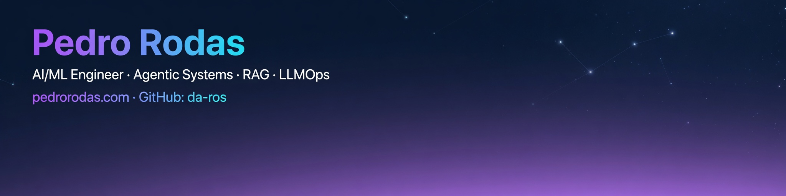

<p align="center">
  
</p>

<h1 align="center">Pedro Rodas</h1>

<h3 align="center">
  AI/ML Engineer building agentic systems, RAG pipelines, and AI-native products.
</h3>

<p align="center">
  <a href="https://pedrorodas.com">Portfolio</a> ·
  <a href="https://github.com/da-ros?tab=repositories">Projects</a> ·
  <a href="https://www.linkedin.com/in/pedro-rodas-m">LinkedIn</a>
</p>

---

## What I build

I build AI-powered software that turns ambiguous user intent into usable systems: agents, retrieval pipelines, voice interfaces, tool-calling workflows, and cloud-deployed applications.

My work sits at the intersection of:

- **Agentic AI systems** — LangGraph, CrewAI, MCP, tool use, planning, structured outputs
- **RAG and LLMOps** — embeddings, vector search, evaluation, semantic caching, retrieval workflows
- **Backend / infra** — FastAPI, Node.js, PostgreSQL, Supabase, Docker, Kubernetes, Terraform, AWS
- **Product engineering** — React, TypeScript, PWAs, UX flows, prototypes, demos, and case studies

---

## Featured systems

| Project | What it proves | Stack |
|---|---|---|
| **AilaBank** | Voice-first agentic fintech using stablecoins, Circle, Arc, and transaction orchestration | OpenAI, Cloudflare STT, ElevenLabs, Circle, Arc, Solidity, Supabase, Redis |
| **Cyberthreat Intelligence Agent** | MCP-powered security analyst that combines live threat APIs with LLM reasoning | FastAPI, OpenAI, VirusTotal, WhoisXMLAPI, MCP, Auth0, Kong, Docker/K8s |
| **AI Gym & Dietary Coach** | LangGraph + Claude vision agents for meal-photo nutrition estimation and MPS-aware coaching | LangGraph, Claude, FastAPI, React, Supabase, PostgreSQL, Docker |
| **Cloud RAG Infrastructure** | RAG workflow deployed on AWS using IaC and Kubernetes | Langflow, Terraform, AWS EKS, Docker, PostgreSQL, Nginx |
| **Banking Microservices System** | Enterprise integration patterns across GraphQL, gRPC, Kafka, CDC, and API gateway | GraphQL, gRPC, Kafka, Debezium, Kong, Auth0, Spring Boot, Node.js |
| **ResearchPal AI Agent** | AI research copilot for searching, synthesizing, and structuring scientific knowledge | RAG, LangChain, MongoDB Atlas, OpenAI embeddings, FastAPI, React |

---

## Technical focus

```txt
AI / LLM       RAG · Agentic RAG · LangGraph · MCP · LlamaIndex · CrewAI · OpenAI · Claude
Backend        Python · FastAPI · Node.js · Express · Java · Spring Boot · REST · GraphQL · gRPC
Frontend       React · TypeScript · Vite · Tailwind · PWA · shadcn/ui
Data / Infra   PostgreSQL · Supabase · MongoDB Atlas · Redis · Kafka · Docker · Kubernetes · Terraform · AWS
Product        UX flows · architecture diagrams · demos · case studies · startup prototyping
```

## Current direction

I’m focused on building AI systems that are not just demos, but usable workflows:

- agents that call tools instead of guessing;
- RAG systems with real retrieval and evaluation paths;
- voice interfaces connected to actual backend actions;
- AI products with clear UX, architecture, and deployment stories.

## Founder/product case study

**Kankaru Logistics Platform** — startup product design for logistics workflows, last-mile coordination, and super-app services across China/SEA-style local service markets.

View case study → <a href="https://www.pedrorodas.com/#projects">pedrorodas.com/#projects</a>

